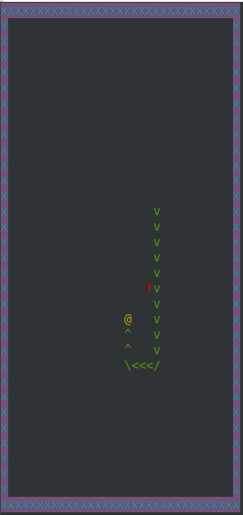

# Snake Game

Install at least one of the libraries:  
  * NCurses  
  * SDL2, SDL2-image
  * freeglut  

Or compile without libs for linux.

```
sudo apt install libncurses5-dev freeglut3-dev libsdl2-dev libsdl2-image-dev
```

Compile:

```
mkdir build
cd build
cmake ..
make [all|snake-sdl|snake-ncurses|snake-glut|snake-nolib-lnx]
```

Run:

```
cd src

./snake-ncurses
or
./snake-sdl
or
./snake-glut
or 
./snake-nolib-lnx
```

## Screenshots



